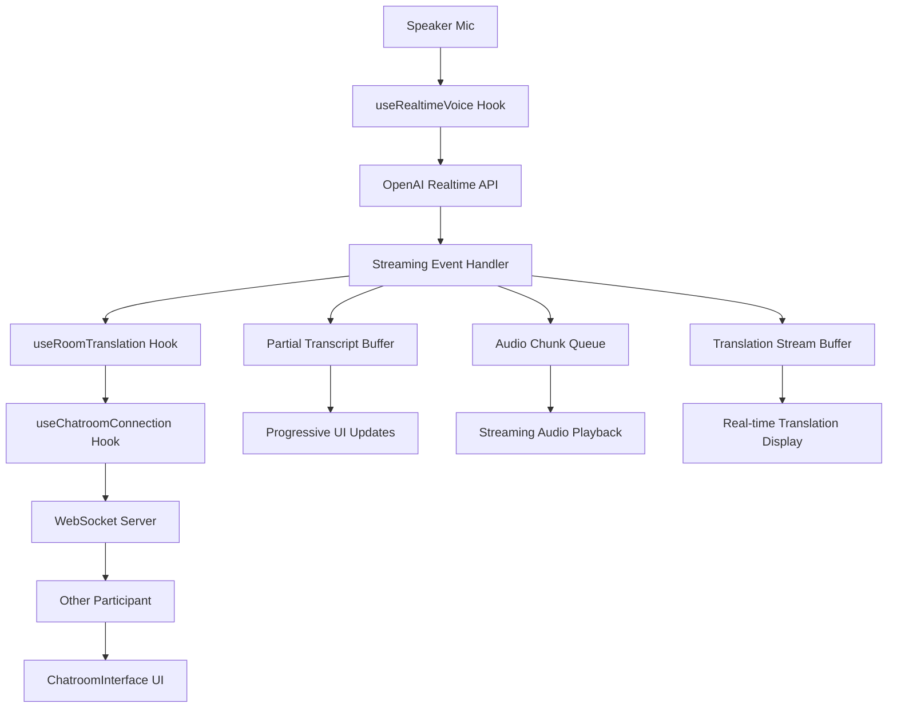

# Design: Real-Time Streaming Optimizations

## Overview
This design document outlines the implementation of real-time streaming optimizations for the WebRTC-based bilingual chatroom, transforming the current batch-based approach into a streaming architecture that provides near-instantaneous feedback.

## Current Architecture Analysis

### Current Flow
```
Speaker Mic → WebRTC → OpenAI Realtime API → Complete Response → Recipient
                                          ↓
                                    Wait for full transcript
                                          ↓
                                    Wait for full translation
                                          ↓
                                    Wait for full audio
                                          ↓
                                    Display/Play everything at once
```

**Current Latency Sources:**
- Waiting for complete sentence transcription (~1-2 seconds)
- Waiting for complete translation (~500ms-1s)
- Waiting for complete audio generation (~1-2 seconds)
- **Total: 3-5 seconds end-to-end**

### Target Streaming Flow
```
Speaker Mic → WebRTC → OpenAI Realtime API → Stream Events → Recipient
                                          ↓
                                    Partial transcript events
                                          ↓
                                    Streaming translation chunks
                                          ↓
                                    Streaming audio chunks
                                          ↓
                                    Real-time display/playback
```

**Target Latency:**
- First word visible: ~100ms
- First audio chunk: ~200ms
- **Total perceived latency: 200-400ms**

## High-Level Architecture

### Component Overview


### Key Architectural Changes

#### 1. Event-Driven Streaming Pipeline
Replace the current callback-based approach with an event-driven streaming system that processes partial data as it arrives.

#### 2. Multi-Buffer System
- **Transcript Buffer**: Accumulates partial transcript chunks
- **Translation Buffer**: Streams translation as it's generated
- **Audio Queue**: Manages streaming audio chunks for seamless playback

#### 3. Optimistic UI Updates
- Show "translating..." indicator immediately on voice activity
- Display partial transcripts word-by-word
- Stream audio chunks without waiting for completion

## Detailed Design

### 1. OpenAI Realtime API Event Handling

#### Current Implementation (useRealtimeVoice.ts)
```typescript
// Current: Wait for complete events
if (event.type === "conversation.item.input_audio_transcription.completed") {
  // Process complete transcript
}
if (event.type === "response.done") {
  // Process complete response
}
```

#### New Streaming Implementation
```typescript
// New: Handle streaming events
if (event.type === "conversation.item.input_audio_transcription.delta") {
  // Process partial transcript chunks
  handlePartialTranscript(event.delta, event.item_id);
}

if (event.type === "response.audio_transcript.delta") {
  // Process streaming translation text
  handleTranslationDelta(event.delta, event.response_id);
}

if (event.type === "response.audio.delta") {
  // Process streaming audio chunks
  handleAudioChunk(event.delta, event.response_id);
}

if (event.type === "input_audio_buffer.speech_started") {
  // Trigger optimistic UI immediately
  handleSpeechStarted();
}
```

### 2. Streaming State Management

#### New State Structure
```typescript
interface StreamingState {
  // Current streaming session
  currentSessionId: string | null;
  
  // Partial transcript accumulation
  partialTranscript: {
    sessionId: string;
    chunks: string[];
    isComplete: boolean;
  } | null;
  
  // Translation streaming
  translationStream: {
    sessionId: string;
    chunks: string[];
    targetLanguage: string;
    isComplete: boolean;
  } | null;
  
  // Audio chunk queue
  audioQueue: {
    sessionId: string;
    chunks: AudioChunk[];
    isPlaying: boolean;
    currentIndex: number;
  } | null;
  
  // UI state
  isOtherSpeaking: boolean;
  showTranslatingIndicator: boolean;
}

interface AudioChunk {
  id: string;
  data: string; // base64 audio data
  timestamp: number;
  duration?: number;
}
```

### 3. Progressive UI Updates

#### Word-by-Word Transcript Display
```typescript
// New component: StreamingTranscript
interface StreamingTranscriptProps {
  partialText: string;
  isComplete: boolean;
  isOwnMessage: boolean;
}

const StreamingTranscript: React.FC<StreamingTranscriptProps> = ({
  partialText,
  isComplete,
  isOwnMessage
}) => {
  const words = partialText.split(' ');
  
  return (
    <div className={`streaming-transcript ${isComplete ? 'complete' : 'partial'}`}>
      {words.map((word, index) => (
        <span
          key={index}
          className="word"
          style={{
            animationDelay: `${index * 50}ms`, // Stagger word appearance
            opacity: isComplete ? 1 : 0.8
          }}
        >
          {word}{' '}
        </span>
      ))}
      {!isComplete && <span className="typing-indicator">...</span>}
    </div>
  );
};
```

#### Optimistic UI Indicator
```typescript
// Enhanced ChatroomInterface with streaming indicators
const [streamingState, setStreamingState] = useState<StreamingState>({
  currentSessionId: null,
  partialTranscript: null,
  translationStream: null,
  audioQueue: null,
  isOtherSpeaking: false,
  showTranslatingIndicator: false
});

// Show indicator immediately on speech detection
useEffect(() => {
  if (streamingState.isOtherSpeaking) {
    setStreamingState(prev => ({
      ...prev,
      showTranslatingIndicator: true
    }));
  }
}, [streamingState.isOtherSpeaking]);
```

### 4. Streaming Audio Playback

#### Audio Chunk Queue Management
```typescript
class StreamingAudioPlayer {
  private audioContext: AudioContext;
  private audioQueue: AudioChunk[] = [];
  private isPlaying: boolean = false;
  private currentSource: AudioBufferSourceNode | null = null;

  async playChunk(chunk: AudioChunk): Promise<void> {
    try {
      // Decode base64 audio data
      const binaryData = atob(chunk.data);
      const arrayBuffer = new ArrayBuffer(binaryData.length);
      const uint8Array = new Uint8Array(arrayBuffer);
      
      for (let i = 0; i < binaryData.length; i++) {
        uint8Array[i] = binaryData.charCodeAt(i);
      }

      // Decode audio buffer
      const audioBuffer = await this.audioContext.decodeAudioData(arrayBuffer);
      
      // Create and play source
      const source = this.audioContext.createBufferSource();
      source.buffer = audioBuffer;
      source.connect(this.audioContext.destination);
      
      source.onended = () => {
        this.playNextChunk();
      };
      
      source.start(0);
      this.currentSource = source;
      
    } catch (error) {
      console.error('Failed to play audio chunk:', error);
      this.playNextChunk(); // Continue with next chunk
    }
  }

  enqueueChunk(chunk: AudioChunk): void {
    this.audioQueue.push(chunk);
    
    if (!this.isPlaying) {
      this.playNextChunk();
    }
  }

  private playNextChunk(): void {
    if (this.audioQueue.length === 0) {
      this.isPlaying = false;
      return;
    }

    this.isPlaying = true;
    const nextChunk = this.audioQueue.shift()!;
    this.playChunk(nextChunk);
  }
}
```

### 5. WebSocket Message Protocol Extensions

#### New Message Types
```typescript
// Streaming transcript events
interface PartialTranscriptEvent {
  type: 'PARTIAL_TRANSCRIPT';
  sessionId: string;
  participantId: string;
  delta: string;
  itemId: string;
  timestamp: number;
}

// Streaming translation events
interface TranslationDeltaEvent {
  type: 'TRANSLATION_DELTA';
  sessionId: string;
  participantId: string;
  delta: string;
  responseId: string;
  targetLanguage: string;
  timestamp: number;
}

// Streaming audio events
interface AudioChunkEvent {
  type: 'AUDIO_CHUNK';
  sessionId: string;
  participantId: string;
  audioData: string; // base64
  chunkId: string;
  timestamp: number;
}

// Voice activity events
interface VoiceActivityEvent {
  type: 'VOICE_ACTIVITY_STARTED' | 'VOICE_ACTIVITY_STOPPED';
  sessionId: string;
  participantId: string;
  timestamp: number;
}
```

### 6. Server-Side Streaming Relay

#### Enhanced WebSocket Handler
```javascript
// server/index.js - Enhanced streaming support
ws.on('message', async (message) => {
  const data = JSON.parse(message);
  
  switch (data.type) {
    case 'PARTIAL_TRANSCRIPT':
      // Relay partial transcript to other participant
      relayToOtherParticipant(data, 'PARTIAL_TRANSCRIPT');
      break;
      
    case 'TRANSLATION_DELTA':
      // Relay translation chunk to other participant
      relayToOtherParticipant(data, 'TRANSLATION_DELTA');
      break;
      
    case 'AUDIO_CHUNK':
      // Relay audio chunk to other participant
      relayToOtherParticipant(data, 'AUDIO_CHUNK');
      break;
      
    case 'VOICE_ACTIVITY_STARTED':
      // Trigger optimistic UI on other participant
      relayToOtherParticipant(data, 'VOICE_ACTIVITY_STARTED');
      break;
  }
});

function relayToOtherParticipant(data, eventType) {
  const session = translationSessions.get(data.sessionId);
  if (!session) return;
  
  const otherParticipant = session.getOtherParticipant(data.participantId);
  if (otherParticipant?.socket?.readyState === WebSocket.OPEN) {
    otherParticipant.socket.send(JSON.stringify({
      ...data,
      type: eventType
    }));
  }
}
```

## Implementation Plan

### Phase 1: Core Streaming Infrastructure
1. **Update useRealtimeVoice Hook**
   - Add streaming event handlers
   - Implement partial transcript buffering
   - Add voice activity detection

2. **Create Streaming State Management**
   - New streaming state structure
   - State update functions for partial data
   - Session management for streaming

3. **Enhance WebSocket Protocol**
   - Add new streaming message types
   - Update server relay logic
   - Implement message ordering

### Phase 2: UI Streaming Components
1. **StreamingTranscript Component**
   - Word-by-word display
   - Animation and transitions
   - Completion states

2. **Optimistic UI Indicators**
   - "Translating..." indicator
   - Voice activity visualization
   - Progress feedback

3. **Update ChatroomInterface**
   - Integrate streaming components
   - Handle streaming state updates
   - Manage UI transitions

### Phase 3: Audio Streaming
1. **StreamingAudioPlayer Class**
   - Audio chunk queue management
   - Seamless playback transitions
   - Error handling and recovery

2. **Audio Integration**
   - Connect to OpenAI audio streams
   - Implement chunk processing
   - Add playback controls

### Phase 4: Optimization & Polish
1. **Performance Optimization**
   - Minimize re-renders
   - Optimize audio processing
   - Reduce memory usage

2. **Error Handling**
   - Stream interruption recovery
   - Network failure handling
   - Graceful degradation

3. **Testing & Validation**
   - Latency measurements
   - Stress testing
   - User experience validation

## File Modifications

### Core Files to Modify

#### 1. src/hooks/useRealtimeVoice.ts
```typescript
// Add streaming event handlers
const handleStreamingEvents = useCallback((event) => {
  switch (event.type) {
    case "input_audio_buffer.speech_started":
      onVoiceActivityStarted?.();
      break;
      
    case "conversation.item.input_audio_transcription.delta":
      onPartialTranscript?.(event.delta, event.item_id);
      break;
      
    case "response.audio_transcript.delta":
      onTranslationDelta?.(event.delta, event.response_id);
      break;
      
    case "response.audio.delta":
      onAudioChunk?.(event.delta, event.response_id);
      break;
  }
}, [onVoiceActivityStarted, onPartialTranscript, onTranslationDelta, onAudioChunk]);
```

#### 2. src/hooks/useRoomTranslation.ts
```typescript
// Add streaming integration
const [streamingState, setStreamingState] = useState<StreamingState>({
  currentSessionId: null,
  partialTranscript: null,
  translationStream: null,
  audioQueue: null,
  isOtherSpeaking: false,
  showTranslatingIndicator: false
});

// Handle streaming events from useRealtimeVoice
const handlePartialTranscript = useCallback((delta: string, itemId: string) => {
  setStreamingState(prev => ({
    ...prev,
    partialTranscript: {
      sessionId: itemId,
      chunks: [...(prev.partialTranscript?.chunks || []), delta],
      isComplete: false
    }
  }));
  
  // Send to other participant via WebSocket
  sendEvent({
    type: 'PARTIAL_TRANSCRIPT',
    sessionId: roomId,
    participantId: participant.id,
    delta,
    itemId,
    timestamp: Date.now()
  });
}, [roomId, participant.id, sendEvent]);
```

#### 3. src/hooks/useChatroomConnection.ts
```typescript
// Add streaming message handlers
case 'PARTIAL_TRANSCRIPT':
  handlePartialTranscript(data);
  break;
  
case 'TRANSLATION_DELTA':
  handleTranslationDelta(data);
  break;
  
case 'AUDIO_CHUNK':
  handleAudioChunk(data);
  break;
  
case 'VOICE_ACTIVITY_STARTED':
  setIsOtherSpeaking(true);
  setShowTranslatingIndicator(true);
  break;
```

#### 4. src/components/ChatroomInterface.tsx
```typescript
// Add streaming UI components
import { StreamingTranscript } from './StreamingTranscript';
import { TranslatingIndicator } from './TranslatingIndicator';

// Render streaming components
{streamingState.showTranslatingIndicator && (
  <TranslatingIndicator 
    participantName={otherParticipant?.name}
    language={getOtherLanguage()}
  />
)}

{streamingState.partialTranscript && (
  <StreamingTranscript
    partialText={streamingState.partialTranscript.chunks.join('')}
    isComplete={streamingState.partialTranscript.isComplete}
    isOwnMessage={false}
  />
)}
```

#### 5. server/index.js
```javascript
// Add streaming message relay
const streamingMessageTypes = [
  'PARTIAL_TRANSCRIPT',
  'TRANSLATION_DELTA', 
  'AUDIO_CHUNK',
  'VOICE_ACTIVITY_STARTED',
  'VOICE_ACTIVITY_STOPPED'
];

if (streamingMessageTypes.includes(data.type)) {
  relayStreamingMessage(data, ws);
}

function relayStreamingMessage(data, senderWs) {
  const connection = activeConnections.get(senderWs);
  if (!connection) return;
  
  const { sessionId } = connection;
  const session = translationSessions.get(sessionId);
  if (!session) return;
  
  // Relay to other participant with minimal latency
  for (const [userId, participant] of session.participants.entries()) {
    if (participant.socket !== senderWs && 
        participant.socket?.readyState === WebSocket.OPEN) {
      participant.socket.send(JSON.stringify(data));
    }
  }
}
```

## Performance Considerations

### Latency Optimization
1. **Minimize Processing Overhead**
   - Use efficient string concatenation for partial transcripts
   - Implement audio chunk pooling to reduce GC pressure
   - Optimize WebSocket message serialization

2. **Network Optimization**
   - Compress audio chunks when possible
   - Batch small transcript deltas to reduce message frequency
   - Use binary WebSocket frames for audio data

3. **UI Optimization**
   - Use React.memo for streaming components
   - Implement virtual scrolling for long conversations
   - Debounce rapid UI updates

### Memory Management
1. **Buffer Size Limits**
   - Limit partial transcript buffer to 1000 characters
   - Maintain audio queue size under 10 chunks
   - Clear completed streaming sessions

2. **Cleanup Strategies**
   - Auto-cleanup streaming state after completion
   - Release audio resources after playback
   - Garbage collect old message buffers

## Error Handling & Fallbacks

### Stream Interruption Recovery
```typescript
// Handle streaming failures gracefully
const handleStreamError = useCallback((error: StreamError) => {
  console.warn('Stream interrupted:', error);
  
  // Fall back to batch mode
  setStreamingMode(false);
  
  // Show user notification
  toast.warning('Switching to standard mode due to connection issues');
  
  // Attempt to recover after delay
  setTimeout(() => {
    setStreamingMode(true);
  }, 5000);
}, []);
```

### Network Failure Handling
```typescript
// Detect and handle network issues
const handleNetworkFailure = useCallback(() => {
  // Buffer streaming data locally
  bufferStreamingData();
  
  // Show offline indicator
  setIsOffline(true);
  
  // Attempt reconnection
  reconnectWithBackoff();
}, []);
```

### Graceful Degradation
```typescript
// Provide fallback experience
const StreamingFallback: React.FC = () => {
  return (
    <div className="streaming-fallback">
      <p>Streaming temporarily unavailable</p>
      <p>Using standard translation mode</p>
    </div>
  );
};
```

## Testing Strategy

### Unit Tests
1. **Streaming State Management**
   - Test partial transcript accumulation
   - Verify audio chunk queuing
   - Validate state transitions

2. **Component Testing**
   - StreamingTranscript word-by-word display
   - TranslatingIndicator timing
   - Audio playback queue management

### Integration Tests
1. **End-to-End Streaming**
   - Full pipeline latency measurement
   - Multi-participant streaming scenarios
   - Network interruption recovery

2. **Performance Testing**
   - Memory usage under streaming load
   - CPU usage during intensive streaming
   - WebSocket message throughput

### User Experience Testing
1. **Latency Perception**
   - A/B test streaming vs batch modes
   - Measure user satisfaction scores
   - Collect feedback on responsiveness

2. **Reliability Testing**
   - Extended streaming sessions
   - Network condition variations
   - Error recovery scenarios

## Success Metrics

### Technical Metrics
- **First Word Latency**: < 100ms (vs current ~1-2s)
- **First Audio Latency**: < 200ms (vs current ~2-3s)
- **End-to-End Latency**: < 400ms (vs current ~3-5s)
- **Stream Reliability**: > 99% successful chunk delivery
- **Memory Usage**: < 50MB per streaming session

### User Experience Metrics
- **Perceived Responsiveness**: "Instant" feedback rating > 90%
- **Conversation Flow**: Natural conversation rating > 85%
- **Error Recovery**: < 1% sessions require manual recovery
- **User Satisfaction**: Overall rating improvement > 40%

## Deployment Strategy

### Rollout Plan
1. **Phase 1**: Deploy to staging environment
2. **Phase 2**: A/B test with 10% of users
3. **Phase 3**: Gradual rollout to 50% of users
4. **Phase 4**: Full deployment with monitoring

### Monitoring & Observability
1. **Real-time Metrics**
   - Streaming latency dashboards
   - Error rate monitoring
   - User experience tracking

2. **Alerting**
   - High latency alerts (> 500ms)
   - Stream failure rate alerts (> 5%)
   - Memory usage alerts (> 100MB)

This design provides a comprehensive foundation for implementing real-time streaming optimizations while maintaining system reliability and user experience quality.